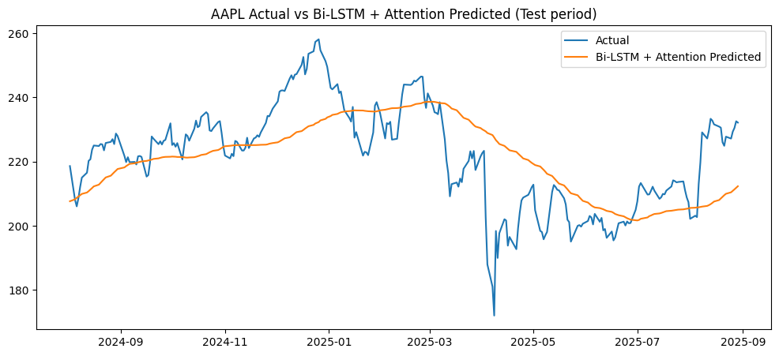

# 📈 MarketVision: Ensemble ML + DL Stock Forecasting  

<p align="center">
  
  
  
  
  
</p>

---

## 🔹 Executive Summary  
**MarketVision** is a hybrid **Machine Learning + Deep Learning** system designed to forecast stock prices and generate **threshold-adjusted trading signals** (Buy / Hold / Sell).  
It integrates **ML models** (Linear Regression, Random Forest, XGBoost) with an optional **Bi-LSTM + Attention** network for sequential patterns, supported by **backtesting & explainability tools**.  

---

## 🚀 Features  
- 📊 **Data Pipeline**: Yahoo Finance integration with rolling-window OHLCV data  
- 🛠 **Feature Engineering**: EMA, RSI, MACD, Bollinger Bands, volatility, lagged returns  
- 🤖 **Model Suite**:  
  - ML → Linear Regression, Random Forest, XGBoost  
  - DL → Bi-LSTM + Attention (optional)  
- 🧩 **Ensemble Strategy**: Chooses best model based on directional accuracy  
- 💹 **Trading Signals**: Threshold-based (Buy / Hold / Sell)  
- 📈 **Backtesting**: Returns, Sharpe ratio, drawdown  
- 🔍 **Explainability**: SHAP values for feature importance  
- ✅ **Validation**: Auto-check with Yahoo Finance latest close  

---

## 📂 Repository Structure  

📦 MarketVision-Ensemble-ML-DL-Stock-Forecasting
┣ 📜 MarketVision_Stock_Forecasting.ipynb # Main notebook
┣ 📜 requirements.txt # Dependencies
┣ 📜 README.md # Documentation
┗ 📂 plots/ # Stores all generated charts and backtest results automatically (e.g., `plots/candlestick_AAPL.png`)  
 


---

## ⚙️ Tech Stack  
- **Languages** → Python (Pandas, NumPy, Matplotlib, Seaborn)  
- **ML Models** → Scikit-learn, XGBoost  
- **DL Models** → TensorFlow/Keras (Bi-LSTM + Attention)  
- **Explainability** → SHAP  
- **Data Source** → Yahoo Finance (`yfinance`)  

---


# Install dependencies
pip install -r requirements.txt

---

## ▶️ Usage

Jupyter Notebook
jupyter notebook MarketVision_Stock_Forecasting.ipynb

VSCode
code MarketVision_Stock_Forecasting.ipynb


1.Open the notebook
2.Enter your desired stock symbol (e.g., AAPL, TSLA).
3.View predictions + ensemble signal + backtest summary.

---

## 📊 Data
This project uses publicly available stock price data from **[Yahoo Finance](https://finance.yahoo.com/)**.  
No raw data is stored in this repository to keep it lightweight.  

You can fetch fresh data anytime using the helper script/notebook:  

```bash
python src/download_data.py --ticker AAPL --period 1y
```
---


## 🧠 Models
This project combines both **Machine Learning** and **Deep Learning** models for stock forecasting:

- **Linear Regression**  
- **Decision Tree Regressor**  
- **Random Forest Regressor**  
- **XGBoost Regressor**  
- **LSTM (Long Short-Term Memory)**  
- **Ensemble Model** (aggregates multiple predictions for a stronger , more reliable signal).

Why Ensemble?

Combining multiple model predictions reduces individual model errors and improves directional accuracy, making BUY / HOLD / SELL signals more robust.


---


## 📊 Example Output  
```text

=== EXECUTIVE SUMMARY ===  
Stock Symbol : AAPL  
Data Range : 2020-01-01 to 2025-08-27 | Rows Used: 1409  
Last Close Price : 230.4900  

Best ML Model : LinearRegression (Directional Accuracy: 0.872)  
Bi-LSTM+Attention : Directional Accuracy: 0.517  

Predicted Next-Day Close Prices:  
ML Prediction : 232.5247 | Expected Return: +0.90% | Threshold Signal: BUY  
LSTM Prediction : 212.8138 | Expected Return: -8.33% | Threshold Signal: SELL  

Ensemble Signal : BUY — ML chosen (higher DirectionAcc: 0.872 vs 0.517)  

Backtest Performance (Test Period):  
Strategy Return : 1.2363  
Buy & Hold Return: 1.0620  
Strategy Sharpe : 0.0541 | Max Drawdown: -0.2420  

```

Example Plot
```python
import matplotlib.pyplot as plt

plt.plot(actual_prices, label='Actual')
plt.plot(predicted_prices, label='Predicted')
plt.legend()
plt.title("Prediction vs Actual Prices")
plt.show()
```


---
## 📌 Example Trading Rule

BUY → Expected return ≥ +0.5%

SELL → Expected return ≤ -0.5%

HOLD → Otherwise


---

## 🧠 Future Enhancements

📈 Multi-stock portfolio optimization

📰 Sentiment analysis from financial news

🤖 LLM-based auto-report generation

🌐 API + Streamlit dashboard for live trading signals

---

## 📜 License

This project is licensed under the MIT License.

---

## 👤 Author

Tamilarasan S — Data Science Enthusiast

🔗 [GitHub](https://github.com/ts1844)        |          💼 [LinkedIn](https://linkedin.com/in/tamilarasans018)  

---
